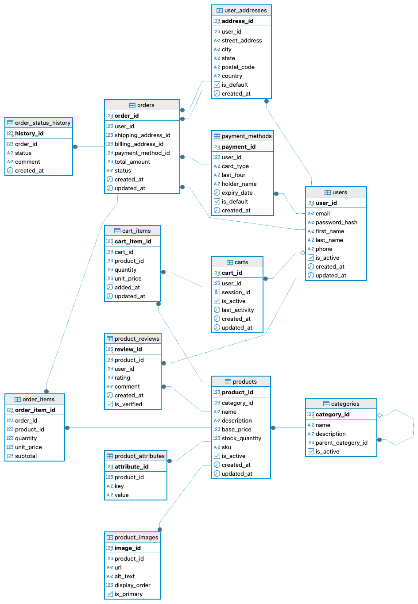

# 9065-Backend

ECE 9065 Final Project Backend Code

## Get Started

1. Run command for creating environment file

```bash
touch .env
```

the .env file should contain the following:

```bash
DATABASE_URL=
DATABASE_NAME=
DATABASE_USER=
DATABASE_PASSWORD=
SERVER_PORT=
CACHE_URL=
EMAIL_KEY=your_resend_api_key
JWT_SECRET=your-256-bit-jwt-secret
JWT_REFRESH_SECRET=your-256-bit-jwt-refresh-secret
JWT_EXPIRES_IN=7h
JWT_REFRESH_EXPIRES_IN=7d
ADMIN_INVITE_SECRET=your-256-bit-admin-invite-secret
```

2. Define database schema in `/src/db/schema.ts` file
3. Run command for applying database schema

```bash
# you can use npm or yarn
pnpm run db:generate
pnpm run db:migrate
```

4. All your API endpoints should be defined in `/src/routes` folder and file name should be based on your module
5. Run command for starting the server

```bash
# you can use npm or yarn
pnpm run dev
```

6. if you want to run the server in production mode, you can use the following command

```bash
# you can use npm or yarn
pnpm run build && pnpm run start
```

## Database


